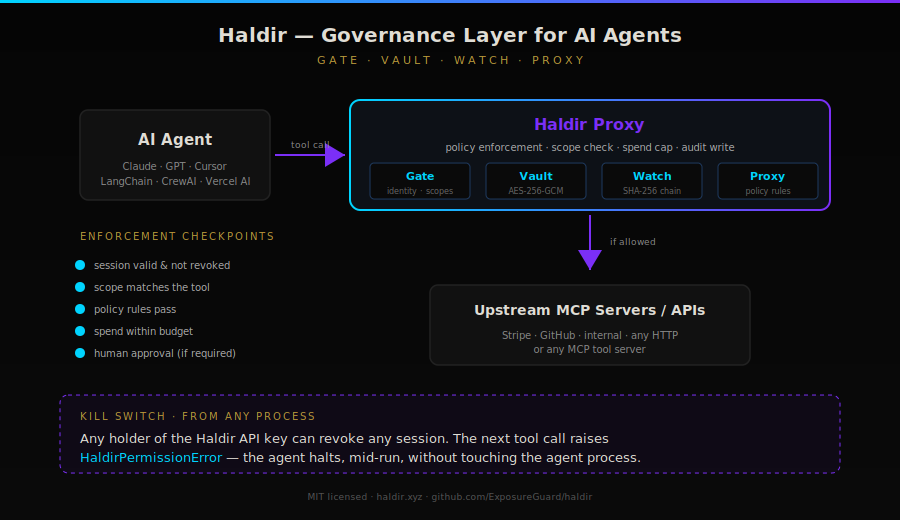

<!-- mcp-name: io.github.ExposureGuard/haldir -->
# Haldir — The Guardian Layer for AI Agents

[](https://github.com/ExposureGuard/haldir/actions/workflows/test.yml)
[](https://codecov.io/gh/ExposureGuard/haldir)
[](https://github.com/ExposureGuard/haldir/blob/main/mypy.ini)
[](https://smithery.ai/server/haldir/haldir)
[](https://pypi.org/project/haldir/)
[](https://pypi.org/project/haldir/)
[](LICENSE)
[](SECURITY.md)
[](https://github.com/ExposureGuard/haldir)
[](https://safeskill.dev/scan/exposureguard-haldir)

**The open-source governance layer for AI agents.** Identity, secrets, audit, and policy enforcement — MIT licensed, self-host or use our cloud.

Haldir enforces governance on every AI agent tool call: scoped sessions with spend caps, encrypted secrets the model never sees, hash-chained tamper-evident audit trail, human-in-the-loop approvals, and a proxy that intercepts every MCP call before it reaches your tools. Native SDKs for LangChain, CrewAI, AutoGen, and Vercel AI SDK.

<p align="center">
  
</p>

<p align="center">
  
</p>

## Two ways to run Haldir

| | Self-host | Cloud ([haldir.xyz](https://haldir.xyz)) |
|---|---|---|
| Price | Free forever | Free tier + paid plans |
| Features | Everything | Everything — same API, same SDKs |
| You run | API + Postgres | Nothing |
| Best for | Regulated industries, air-gapped, "must own data" | "Just make it work" |

### Self-host in 5 minutes

```bash
git clone https://github.com/ExposureGuard/haldir.git
cd haldir
cp .env.example .env
python3 -c 'import base64, os; print(base64.urlsafe_b64encode(os.urandom(32)).decode())'
# paste the output into .env as HALDIR_ENCRYPTION_KEY, then:
docker compose up -d
curl http://localhost:8000/health
```

Full self-hosting guide: [SELF_HOSTING.md](SELF_HOSTING.md)

### Or use our cloud

```bash
pip install haldir
```

That's it — point at `https://haldir.xyz`, no signup, live API.

---

> **Live now:** [haldir.xyz](https://haldir.xyz) · [API Docs](https://haldir.xyz/docs) · [OpenAPI Spec](https://haldir.xyz/openapi.json) · [Smithery](https://smithery.ai/server/haldir/haldir)
>
> 🧪 **Now accepting 5 design partners.** 30 days free, full access, direct line to the founder. If you're shipping AI agents to production, email [sterling@haldir.xyz](mailto:sterling@haldir.xyz?subject=Haldir%20Design%20Partner).

## Performance

Haldir is fast enough to sit in the hot path of every agent tool call without becoming the bottleneck.

**Single-box HTTP throughput** (gunicorn 4 workers, 32 concurrent clients, tuned SQLite backend, every request goes through the full middleware stack — auth, validation, idempotency, metrics, structured logging):

| Endpoint | RPS | p50 | p95 | p99 |
| --- | --- | --- | --- | --- |
| `GET /healthz` | 1,638 | 19.1 ms | 32.5 ms | 41.6 ms |
| `GET /v1/status` | 1,382 | 22.2 ms | 30.8 ms | 45.4 ms |
| `GET /v1/sessions/:id` | 903 | 29.2 ms | 95.5 ms | 172.1 ms |
| `POST /v1/sessions` (create) | 1,142 | 27.7 ms | 35.2 ms | 39.9 ms |
| `POST /v1/audit` (hash-chain write) | 1,092 | 28.7 ms | 37.6 ms | 52.6 ms |

Hardware: 12th-gen Intel Core i3-1215U (8 cores, 8 GB RAM). SQLite is configured with WAL + synchronous=NORMAL + 256 MiB mmap + in-memory temp store — the session-lookup p99 dropped by 52 % versus the untuned path. Postgres deployments (configurable pool via `HALDIR_PG_POOL_MIN/MAX`) flatten the p99 further still; enable via `DATABASE_URL=postgresql://...`.

**Primitive cost** (pure-Python, no I/O):

| Primitive | p50 | Notes |
|---|---|---|
| `Vault.store_secret` (AES-256-GCM encrypt + AAD binding) | **< 10 µs** | in-memory, no DB write |
| `Vault.get_secret` (AES-256-GCM decrypt + AAD verify) | **< 10 µs** | in-memory |
| `AuditEntry.compute_hash` (SHA-256 over canonical payload) | **< 10 µs** | |
| `Gate.check_permission` over REST | ~50-120 ms | network + DB round-trip, Cloudflare-fronted |
| `Watch.log_action` over REST | ~50-150 ms | includes chain lookup + DB write |
| Full governed-tool envelope (check + log) | ~100-250 ms | |

Agents typically wait 500-3000 ms for an LLM completion and 100-1000 ms for an upstream API call, so Haldir's overhead sits inside the noise. Reproduce locally:

```bash
# Concurrent HTTP throughput (launches a local gunicorn, ~60s total)
python bench/bench_http.py --duration 10 --concurrency 32 --workers 4

# Primitive cost only (no API key needed)
python bench/bench_primitives.py --local

# End-to-end against the hosted service
export HALDIR_API_KEY=hld_...
python bench/bench_primitives.py
```

## Why Haldir

AI agents are calling APIs, spending money, and accessing credentials with zero oversight. Haldir is the missing layer:

| Without Haldir | With Haldir |
|---|---|
| Agent has unlimited access | Scoped sessions with permissions |
| Secrets in plaintext env vars | AES-encrypted vault with access control |
| No spend limits | Per-session budget enforcement |
| No record of what happened | Immutable audit trail |
| No human oversight | Approval workflows with webhooks |
| Agent talks to tools directly | Proxy intercepts and enforces policies |

## Quick Start

```bash
pip install haldir
```

```python
from sdk.client import HaldirClient

h = HaldirClient(api_key="hld_xxx", base_url="https://haldir.xyz")

# Create a governed agent session
session = h.create_session("my-agent", scopes=["read", "spend:50"])

# Store secrets agents never see directly
h.store_secret("stripe_key", "sk_live_xxx")

# Retrieve with scope enforcement
key = h.get_secret("stripe_key", session_id=session["session_id"])

# Authorize payments against budget
h.authorize_payment(session["session_id"], 29.99)

# Every action is logged
h.log_action(session["session_id"], tool="stripe", action="charge", cost_usd=29.99)

# Revoke when done
h.revoke_session(session["session_id"])
```

## Products

### Gate — Agent Identity & Auth
Scoped sessions with permissions, spend limits, and TTL. No session = no access.

```bash
curl -X POST https://haldir.xyz/v1/sessions \
  -H "Authorization: Bearer hld_xxx" \
  -H "Content-Type: application/json" \
  -d '{"agent_id": "my-bot", "scopes": ["read", "browse", "spend:50"], "ttl": 3600}'
```

### Vault — Encrypted Secrets & Payments
AES-encrypted storage. Agents request access; Vault checks session scope. Payment authorization with per-session budgets.

```bash
curl -X POST https://haldir.xyz/v1/secrets \
  -H "Authorization: Bearer hld_xxx" \
  -H "Content-Type: application/json" \
  -d '{"name": "api_key", "value": "sk_live_xxx", "scope_required": "read"}'
```

### Watch — Audit Trail & Compliance
Immutable log for every action. Anomaly detection. Cost tracking. Compliance exports.

```bash
curl https://haldir.xyz/v1/audit?agent_id=my-bot \
  -H "Authorization: Bearer hld_xxx"
```

### Proxy — Enforcement Layer
Sits between agents and MCP servers. Every tool call is intercepted, authorized, and logged. Supports policy enforcement: allow lists, deny lists, spend limits, rate limits, time windows.

```bash
# Register an upstream MCP server
curl -X POST https://haldir.xyz/v1/proxy/upstreams \
  -H "Authorization: Bearer hld_xxx" \
  -H "Content-Type: application/json" \
  -d '{"name": "myserver", "url": "https://my-mcp-server.com/mcp"}'

# Call through the proxy — governance enforced
curl -X POST https://haldir.xyz/v1/proxy/call \
  -H "Authorization: Bearer hld_xxx" \
  -H "Content-Type: application/json" \
  -d '{"tool": "scan_domain", "arguments": {"domain": "example.com"}, "session_id": "ses_xxx"}'
```

### Approvals — Human-in-the-Loop
Pause agent execution for human review. Webhook notifications. Approve or deny from dashboard or API.

```bash
# Require approval for spend over $100
curl -X POST https://haldir.xyz/v1/approvals/rules \
  -H "Authorization: Bearer hld_xxx" \
  -H "Content-Type: application/json" \
  -d '{"type": "spend_over", "threshold": 100}'
```

## MCP Server

Haldir is available as an MCP server with 10 tools for Claude, Cursor, Windsurf, and any MCP-compatible AI:

```json
{
  "mcpServers": {
    "haldir": {
      "command": "haldir-mcp",
      "env": {
        "HALDIR_API_KEY": "hld_xxx"
      }
    }
  }
}
```

**MCP Tools:** `createSession`, `getSession`, `revokeSession`, `checkPermission`, `storeSecret`, `getSecret`, `authorizePayment`, `logAction`, `getAuditTrail`, `getSpend`

**MCP HTTP Endpoint:** `POST https://haldir.xyz/mcp`

## Architecture

```
Agent (Claude, GPT, Cursor, etc.)
    │
    ▼
┌─────────────────────────────┐
│       Haldir Proxy          │  ← Intercepts every tool call
│  Policy enforcement layer   │
└──────┬──────────┬───────────┘
       │          │
  ┌────▼────┐ ┌───▼────┐
  │  Gate   │ │ Watch  │
  │identity │ │ audit  │
  │sessions │ │ costs  │
  └────┬────┘ └────────┘
       │
  ┌────▼────┐
  │ Vault   │
  │secrets  │
  │payments │
  └────┬────┘
       │
       ▼
  Upstream MCP Servers
  (your actual tools)
```

## API Reference

Full docs at [haldir.xyz/docs](https://haldir.xyz/docs)

| Endpoint | Method | Description |
|---|---|---|
| `/v1/keys` | POST | Create API key |
| `/v1/sessions` | POST | Create agent session |
| `/v1/sessions/:id` | GET | Get session info |
| `/v1/sessions/:id` | DELETE | Revoke session |
| `/v1/sessions/:id/check` | POST | Check permission |
| `/v1/secrets` | POST | Store secret |
| `/v1/secrets/:name` | GET | Retrieve secret |
| `/v1/secrets` | GET | List secrets |
| `/v1/secrets/:name` | DELETE | Delete secret |
| `/v1/payments/authorize` | POST | Authorize payment |
| `/v1/audit` | POST | Log action |
| `/v1/audit` | GET | Query audit trail |
| `/v1/audit/spend` | GET | Spend summary |
| `/v1/approvals/rules` | POST | Add approval rule |
| `/v1/approvals/request` | POST | Request approval |
| `/v1/approvals/:id` | GET | Check approval status |
| `/v1/approvals/:id/approve` | POST | Approve |
| `/v1/approvals/:id/deny` | POST | Deny |
| `/v1/approvals/pending` | GET | List pending |
| `/v1/webhooks` | POST | Register webhook |
| `/v1/webhooks` | GET | List webhooks |
| `/v1/proxy/upstreams` | POST | Register upstream |
| `/v1/proxy/tools` | GET | List proxy tools |
| `/v1/proxy/call` | POST | Call through proxy |
| `/v1/proxy/policies` | POST | Add policy |
| `/v1/usage` | GET | Usage stats |
| `/v1/metrics` | GET | Platform metrics |

## Agent Discovery

Haldir is discoverable through every major protocol:

| URL | Protocol |
|---|---|
| `haldir.xyz/openapi.json` | OpenAPI 3.1 |
| `haldir.xyz/llms.txt` | LLM-readable docs |
| `haldir.xyz/.well-known/ai-plugin.json` | ChatGPT plugins |
| `haldir.xyz/.well-known/mcp/server-card.json` | MCP discovery |
| `haldir.xyz/mcp` | MCP JSON-RPC |
| `smithery.ai/server/haldir/haldir` | Smithery registry |
| `pypi.org/project/haldir` | PyPI |

## License

MIT

## Links

- **Website:** [haldir.xyz](https://haldir.xyz)
- **API Docs:** [haldir.xyz/docs](https://haldir.xyz/docs)
- **Smithery:** [View on Smithery](https://smithery.ai/server/haldir/haldir)
- **PyPI:** [haldir](https://pypi.org/project/haldir/)
- **OpenAPI:** [haldir.xyz/openapi.json](https://haldir.xyz/openapi.json)
