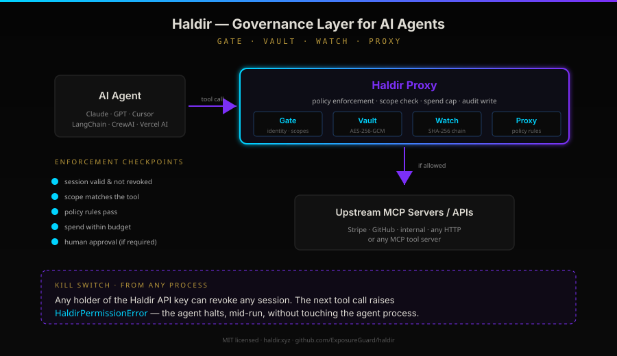
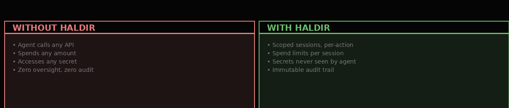
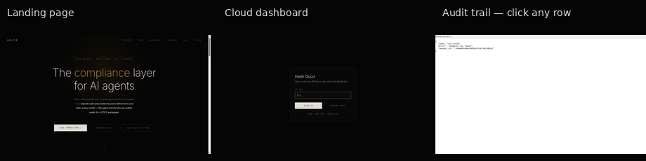
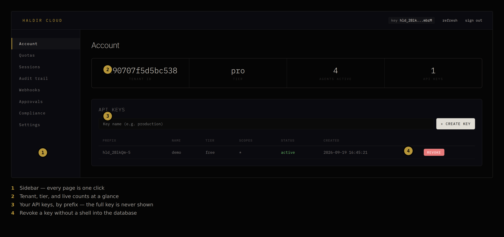

<!-- mcp-name: io.github.ExposureGuard/haldir -->
# Haldir — Governance for AI Agents

[](https://github.com/ExposureGuard/haldir/actions/workflows/test.yml)
[](https://codecov.io/gh/ExposureGuard/haldir)
[](https://github.com/ExposureGuard/haldir/blob/main/mypy.ini)
[](https://smithery.ai/server/haldir/haldir)
[](https://pypi.org/project/haldir/)
[](https://pypi.org/project/haldir/)
[](LICENSE)
[](SECURITY.md)
[](https://github.com/ExposureGuard/haldir)
[](https://safeskill.dev/scan/exposureguard-haldir)

Your AI agent can call any API, spend any amount of money, and access any secret — with zero oversight.

**Haldir** sits between your agent and its tools to enforce:

- **Scoped sessions** with permissions and spend caps
- **Encrypted secrets** the model never sees directly
- **Immutable, hash-chained audit trail** (RFC 6962 Merkle tamper-evidence)
- **Human-in-the-loop approvals** with webhook notifications

For developers and teams shipping AI agents (Claude Code, Cursor, LangChain, CrewAI, AutoGen, Vercel AI SDK) to production and wanting guardrails without building them from scratch.

MIT licensed. Self-host or use our cloud.

<p align="center">
  
</p>

<p align="center">
  
</p>

## See it in action

Here's what Haldir actually looks like — no diagrams, no spec sheets, just screenshots of the real thing.

<p align="center">
  
</p>

Without Haldir, an agent calls whatever API it wants, spends whatever it wants, and accesses whatever secret it finds — with zero oversight and zero audit trail. With Haldir, every action is scoped, spend-limited, logged immutably, and secrets never leave the vault.

Here's the three things you'd see as a new visitor, in order:

<p align="center">
  
</p>

1. **Landing page** — dark mode, live terminal animation at the top, four product cards (Gate, Vault, Watch, Proxy), a self-host vs cloud comparison, and a call to claim a design partner spot. One page, everything a first-time visitor needs.

2. **Cloud dashboard** — this is what you see after signing in. A sidebar on the left, your tenant and key stats up top, and tables below for sessions and audit entries. One click takes you to any page — account, quotas, sessions, audit, webhooks, approvals, compliance, or settings.

3. **Audit trail** — the killer feature. Filter by session, agent, or tool. Click any row to see the full MCP call details: what tool was called, what upstream API it hit, how long it took, what arguments it sent, and what it returned. This is the one thing that makes the whole product click — you can see exactly what every agent did, when, and with what.

Here's the dashboard with the important parts labeled:

<p align="center">
  
</p>

The sidebar on the left takes you anywhere. The gold labels show the overview (tenant, tier, stats at a glance). The red labels show the two things you'll actually use every day: active sessions (with spend and revoke) and the audit trail (every tool call, filterable, expandable).

### Play with it yourself

There's a live demo you can poke at right now — no signup, runs in your browser:

→ **[Try the tamper demo →](/demo)** — it runs a hash-chained audit log in your browser and lets you try to tamper with it yourself. You'll see for yourself that the chain breaks when anyone edits a past entry.

### The rest of the site

The docs, pricing page, quickstart, compliance evidence pack, and every other page are linked from the nav bar on every page. The README has the full API reference, Python quickstart, performance numbers, and compliance mapping.

Try the real thing at **[haldir.xyz](https://haldir.xyz)** — free tier, no signup, point at it from any agent and go.

---

## Try it in 2 minutes

```bash
pip install haldir
haldir overview
```

Want the cloud version with a free tier?
→ **[haldir.xyz](https://haldir.xyz)** — now accepting design partners (30 days free, full access, direct line to the founder).## Two ways to run

|                  | Self-host                  | Cloud ([haldir.xyz](https://haldir.xyz))   |
| ---------------- | ------------------------- | ------------------------------------------- |
| Price            | Free forever              | Free tier + paid plans                      |
| You run          | API + Postgres            | Nothing                                     |
| Best for         | Regulated, air-gapped, "must own data" | "Just make it work"            |

### Self-host in 5 minutes

```bash
git clone https://github.com/ExposureGuard/haldir.git
cd haldir
cp .env.example .env
python3 -c 'import base64, os; print(base64.urlsafe_b64encode(os.urandom(32)).decode())'
# paste the output into .env as HALDIR_ENCRYPTION_KEY, then:
docker compose up -d
curl http://localhost:8000/health
```

Full self-hosting guide: [SELF_HOSTING.md](SELF_HOSTING.md)

### Cloud (no setup)

```bash
pip install haldir
```

That's it — point at `https://haldir.xyz`, no signup for the free tier.

---

## CLI

Install once, drive the whole platform from the terminal:

```text
$ haldir overview

  Haldir tenant overview
  acct_xyz123  ·  tier pro  ·  2026-04-19T18:42:11+00:00

  Status     ● ok
  Actions      4,217 / 50,000   ████░░░░░░░░░░░░░░░░    8.4%
  Spend      $ 47.30 this month
  Sessions        12 active  ·  3/10 agents
  Vault            8 secrets  ·  62 accesses this month
  Audit        1,847 entries  ·  0 flagged (7d)  ·  chain ✓
  Webhooks         2 registered  ·  541 deliveries (24h)  ·  99.82% success
  Approvals        1 pending
```

```bash
pip install haldir
haldir login                           # one-time; stashes API key
haldir overview --watch                # top-style live dashboard
haldir status                          # green/yellow/red component pills
haldir ready                           # exits 0/1, perfect for CI
haldir audit tail --agent my-bot       # the last N entries
haldir audit export --format=jsonl --out audit-2026-04.jsonl
haldir audit verify                    # hash chain integrity check
haldir webhooks deliveries             # last 20 retry attempts
haldir migrate up                      # apply pending schema migrations
```

Every command takes `--json` for scripts. `haldir --help` for the full surface.

---

## Why Haldir

AI agents are calling APIs, spending money, and accessing credentials with zero oversight. Haldir is the missing layer:

| Without Haldir              | With Haldir                        |
| --------------------------- | ---------------------------------- |
| Agent has unlimited access  | Scoped sessions with permissions   |
| Secrets in plaintext env vars| AES-256-GCM encrypted vault       |
| No spend limits             | Per-session budget enforcement     |
| No record of what happened  | Immutable, tamper-evident audit    |
| No human oversight          | Approval workflows with webhooks   |
| Agent talks to tools directly| Proxy intercepts + enforces        |

---

## Quick Start (Python)

```python
from sdk.client import HaldirClient

h = HaldirClient(api_key="hld_xxx", base_url="https://haldir.xyz")

# Create a governed agent session
session = h.create_session("my-agent", scopes=["read", "spend:50"])

# Store secrets agents never see directly
h.store_secret("stripe_key", "sk_live_xxx")

# Retrieve with scope enforcement
key = h.get_secret("stripe_key", session_id=session["session_id"])

# Authorize payments against budget
h.authorize_payment(session["session_id"], 29.99)

# Every action is logged
h.log_action(session["session_id"], tool="stripe", action="charge", cost_usd=29.99)

# Revoke when done
h.revoke_session(session["session_id"])
```

---

## Products

### Gate — Agent Identity & Auth
Scoped sessions with permissions, spend limits, and TTL. No session = no access.

```bash
curl -X POST https://haldir.xyz/v1/sessions \
  -H "Authorization: Bearer hld_xxx" \
  -H "Content-Type: application/json" \
  -d '{"agent_id": "my-bot", "scopes": ["read", "browse", "spend:50"], "ttl": 3600}'
```

### Vault — Encrypted Secrets & Payments
AES-encrypted storage. Agents request access; Vault checks session scope. Payment authorization with per-session budgets.

```bash
curl -X POST https://haldir.xyz/v1/secrets \
  -H "Authorization: Bearer hld_xxx" \
  -H "Content-Type: application/json" \
  -d '{"name": "api_key", "value": "sk_live_xxx", "scope_required": "read"}'
```

### Watch — Audit Trail & Compliance
Immutable log for every action. Anomaly detection. Cost tracking. Compliance exports.

```bash
curl https://haldir.xyz/v1/audit?agent_id=my-bot \
  -H "Authorization: Bearer hld_xxx"
```

### Proxy — Enforcement Layer
Sits between agents and MCP servers. Every tool call is intercepted, authorized, and logged. Supports policy enforcement: allow lists, deny lists, spend limits, rate limits, time windows.

```bash
# Register an upstream MCP server
curl -X POST https://haldir.xyz/v1/proxy/upstreams \
  -H "Authorization: Bearer hld_xxx" \
  -H "Content-Type: application/json" \
  -d '{"name": "myserver", "url": "https://my-mcp-server.com/mcp"}'

# Call through the proxy — governance enforced
curl -X POST https://haldir.xyz/v1/proxy/call \
  -H "Authorization: Bearer hld_xxx" \
  -H "Content-Type: application/json" \
  -d '{"tool": "scan_domain", "arguments": {"domain": "example.com"}, "session_id": "ses_xxx"}'
```

### Approvals — Human-in-the-Loop
Pause agent execution for human review. Webhook notifications. Approve or deny from dashboard or API.

```bash
# Require approval for spend over $100
curl -X POST https://haldir.xyz/v1/approvals/rules \
  -H "Authorization: Bearer hld_xxx" \
  -H "Content-Type: application/json" \
  -d '{"type": "spend_over", "threshold": 100}'
```

---

## MCP Server

Haldir is available as an MCP server with 10 tools for Claude, Cursor, Windsurf, and any MCP-compatible AI:

```json
{
  "mcpServers": {
    "haldir": {
      "command": "haldir-mcp",
      "env": {
        "HALDIR_API_KEY": "hld_xxx"
      }
    }
  }
}
```

**MCP Tools:** `createSession`, `getSession`, `revokeSession`, `checkPermission`, `storeSecret`, `getSecret`, `authorizePayment`, `logAction`, `getAuditTrail`, `getSpend`

**MCP HTTP Endpoint:** `POST https://haldir.xyz/mcp`

---

## Performance

Haldir is fast enough to sit in the hot path of every agent tool call without becoming the bottleneck.

**Single-box HTTP throughput** (gunicorn 4 workers, 32 concurrent clients, tuned SQLite backend, every request goes through the full middleware stack — auth, validation, idempotency, metrics, structured logging):

| Endpoint                         | RPS   | p50   | p95    | p99    |
| -------------------------------- | ----- | ----- | ------ | ------ |
| `GET /healthz`                   | 1,638 | 19.1 ms | 32.5 ms | 41.6 ms |
| `GET /v1/status`                | 1,382 | 22.2 ms | 30.8 ms | 45.4 ms |
| `GET /v1/sessions/:id`          | 903   | 29.2 ms | 95.5 ms | 172.1 ms |
| `POST /v1/sessions` (create)    | 1,142 | 27.7 ms | 35.2 ms | 39.9 ms |
| `POST /v1/audit` (hash-chain)   | 1,092 | 28.7 ms | 37.6 ms | 52.6 ms |

Hardware: 12th-gen Intel Core i3-1215U (8 cores, 8 GB RAM). SQLite is configured with WAL + synchronous=NORMAL + 256 MiB mmap + in-memory temp store — the session-lookup p99 dropped by 52 % versus the untuned path. Postgres deployments (configurable pool via `HALDIR_PG_POOL_MIN/MAX`) flatten the p99 further still; enable via `DATABASE_URL=postgresql://...`.

**Primitive cost** (pure-Python, no I/O):

| Primitive                                           | p50      | Notes                                          |
| -------------------------------------------------- | -------- | ---------------------------------------------- |
| `Vault.store_secret` (AES-256-GCM encrypt + AAD)  | **< 10 µs** | in-memory, no DB write                       |
| `Vault.get_secret` (AES-256-GCM decrypt + AAD)   | **< 10 µs** | in-memory                                      |
| `AuditEntry.compute_hash` (SHA-256 over payload) | **< 10 µs** |                                                |
| `Gate.check_permission` over REST                 | ~50-120 ms | network + DB round-trip, Cloudflare-fronted |
| `Watch.log_action` over REST                      | ~50-150 ms | includes chain lookup + DB write             |
| Full governed-tool envelope (check + log)         | ~100-250 ms |                                                |

Agents typically wait 500-3000 ms for an LLM completion and 100-1000 ms for an upstream API call, so Haldir's overhead sits inside the noise. Reproduce locally:

```bash
# Concurrent HTTP throughput (launches a local gunicorn, ~60s total)
python bench/bench_http.py --duration 10 --concurrency 32 --workers 4

# Primitive cost only (no API key needed)
python bench/bench_primitives.py --local

# End-to-end against the hosted service
export HALDIR_API_KEY=hld_...
python bench/bench_primitives.py
```

---

## Compliance

One endpoint produces an auditor-ready proof-of-control pack covering eight sections, each anchored to a SOC2 trust services criterion:

```bash
haldir compliance evidence --since 2026-01-01 --out evidence-q1-2026.md
```

| # | Section                                    | SOC2  |
| - | -------------------------------------------| ----- |
| 1 | Identity (tenant, subscription, period)    | —     |
| 2 | Access control (API keys + per-key scopes) | CC6.1 |
| 3 | Encryption (AES-256-GCM, AAD binding)      | CC6.7 |
| 4 | Audit trail (entry count, hash chain)      | CC7.2 |
| 5 | Spend governance (per-session caps)        | CC5.2 |
| 6 | Human approvals (request/decision lifecycle)| CC8.1 |
| 7 | Outbound alerting (webhook delivery rate)  | CC7.3 |
| 8 | Document signature (SHA-256 self-hash)     | —     |

The pack signs itself: a SHA-256 over the canonical JSON of sections 1-7. An auditor receiving an archived pack can re-call `/v1/compliance/evidence/manifest` and confirm the digest matches — proof the document was not modified after issuance.

JSON for evidence-locker upload, Markdown for the "show this to the auditor" moment, both from the same `/v1/compliance/evidence` endpoint.

---

## API Reference

Full docs at [haldir.xyz/docs](https://haldir.xyz/docs) — the complete OpenAPI 3.1 spec is at [haldir.xyz/openapi.json](https://haldir.xyz/openapi.json).

Key endpoints (see the spec for the full surface):

| Endpoint                                | Method   | Description                    |
| ---------------------------------------- | -------- | ------------------------------ |
| `/v1/keys`                               | POST     | Create API key                 |
| `/v1/sessions`                           | POST     | Create agent session           |
| `/v1/sessions/:id`                       | GET/DEL  | Get / revoke session           |
| `/v1/sessions/:id/check`                 | POST     | Check permission               |
| `/v1/secrets`                            | POST/GET/DEL | Store / list / delete secrets |
| `/v1/payments/authorize`                 | POST     | Authorize payment              |
| `/v1/audit`                              | POST/GET | Log / query actions            |
| `/v1/audit/spend`                        | GET      | Spend summary                  |
| `/v1/approvals/rules`                    | POST     | Add approval rule              |
| `/v1/approvals/request`                  | POST     | Request approval               |
| `/v1/approvals/:id/approve`              | POST     | Approve                        |
| `/v1/approvals/:id/deny`                 | POST     | Deny                           |
| `/v1/webhooks`                           | POST/GET | Register / list webhooks       |
| `/v1/proxy/upstreams`                    | POST     | Register upstream MCP server   |
| `/v1/proxy/call`                         | POST     | Call through the proxy         |
| `/v1/usage`                              | GET      | Usage stats                    |
| `/v1/metrics`                            | GET      | Platform metrics               |

---

## Agent Discovery

Haldir is discoverable through every major protocol:

| URL                                          | Protocol                      |
| -------------------------------------------- | ------------------------------ |
| `haldir.xyz/openapi.json`                    | OpenAPI 3.1                   |
| `haldir.xyz/llms.txt`                        | LLM-readable docs             |
| `haldir.xyz/.well-known/ai-plugin.json`      | ChatGPT plugins               |
| `haldir.xyz/.well-known/mcp/server-card.json`| MCP discovery                 |
| `haldir.xyz/mcp`                             | MCP JSON-RPC                  |
| `smithery.ai/server/haldir/haldir`           | Smithery registry             |
| `pypi.org/project/haldir`                    | PyPI                           |

---

## Design partners wanted

**Live now:** [haldir.xyz](https://haldir.xyz) · [API Docs](https://haldir.xyz/docs) · [OpenAPI Spec](https://haldir.xyz/openapi.json) · [Smithery](https://smithery.ai/server/haldir/haldir)

We're taking **5 design partners** — 30 days free, full access, direct line to the founder. If you're shipping AI agents to production, email [sterling@haldir.xyz](mailto:sterling@haldir.xyz?subject=Haldir%20Design%20Partner).

---

## License

MIT

---

## Links

- **Website:** [haldir.xyz](https://haldir.xyz)
- **API Docs:** [haldir.xyz/docs](https://haldir.xyz/docs)
- **Smithery:** [View on Smithery](https://smithery.ai/server/haldir/haldir)
- **PyPI:** [haldir](https://pypi.org/project/haldir/)
- **OpenAPI:** [haldir.xyz/openapi.json](https://haldir.xyz/openapi.json)
